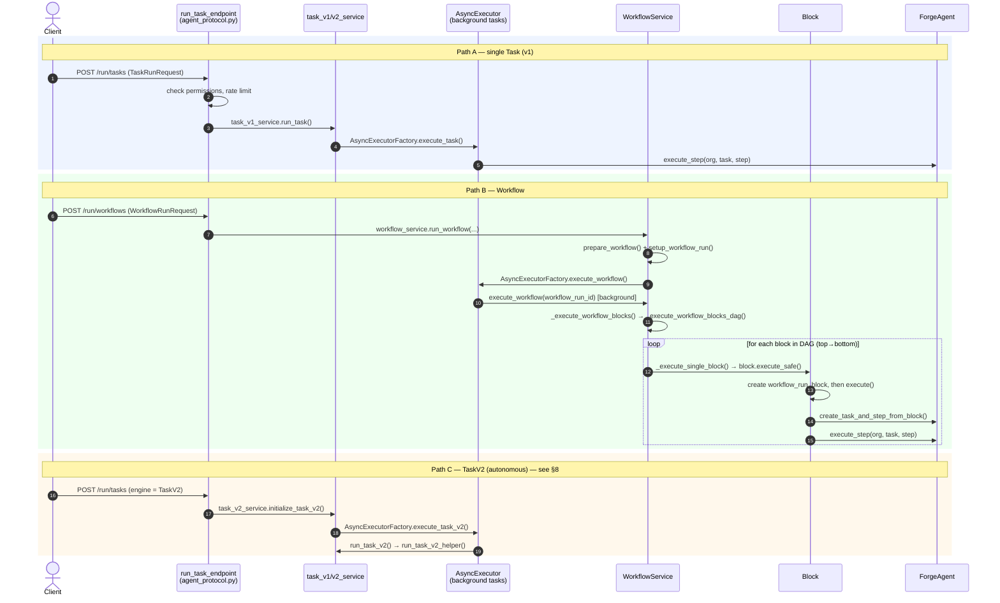
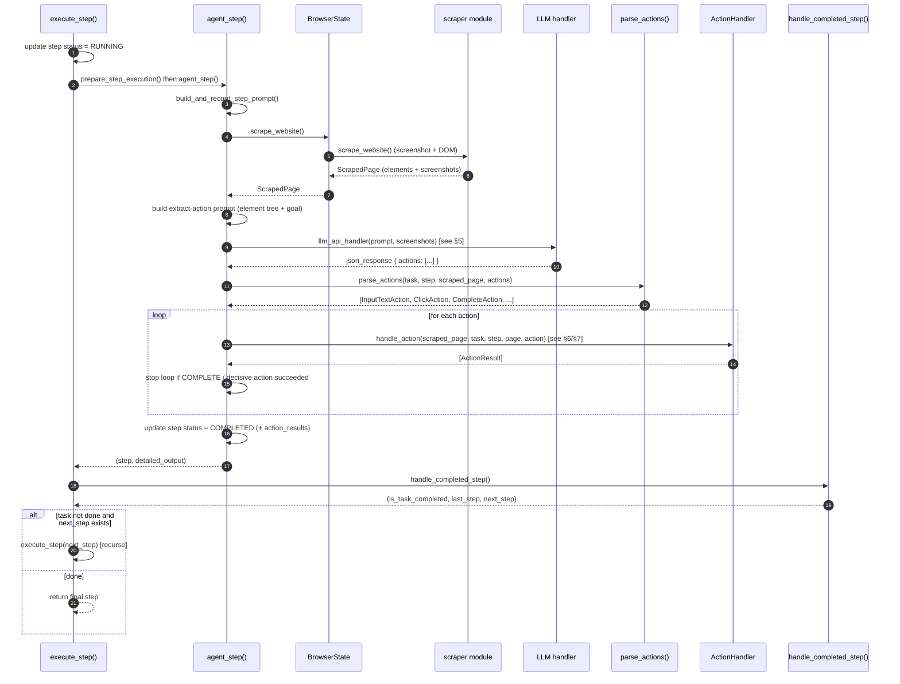
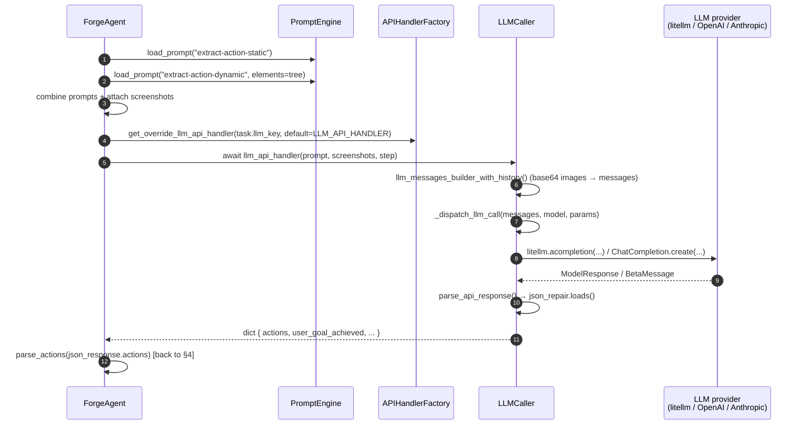
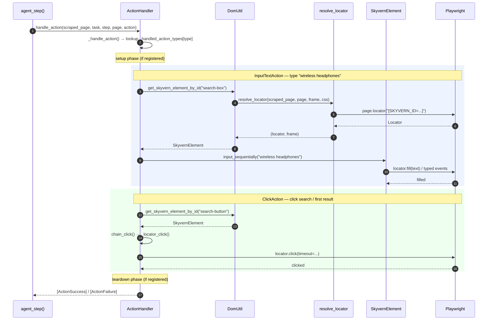
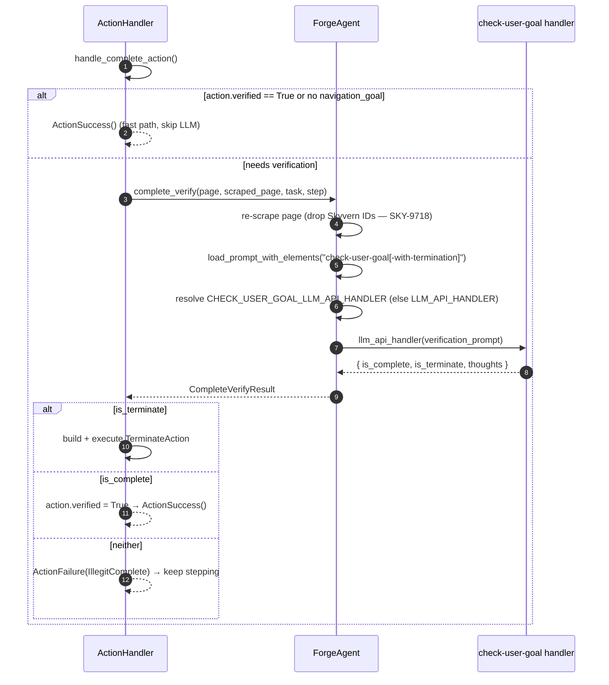
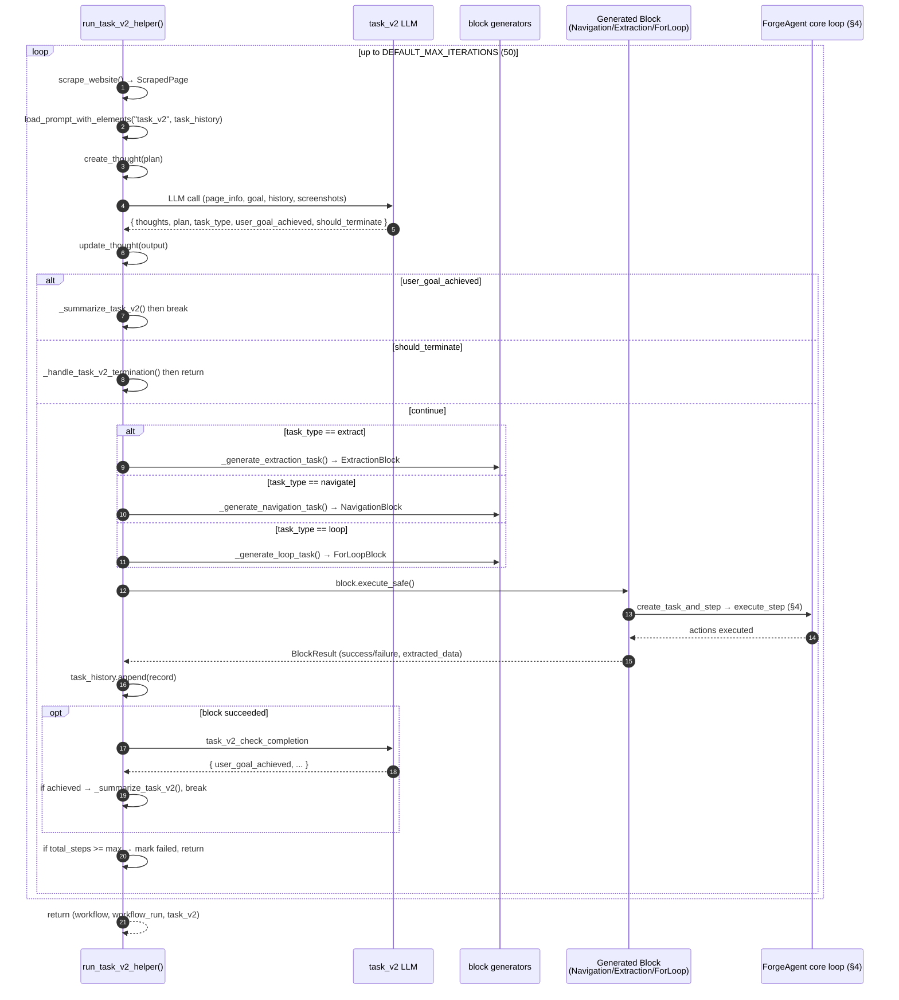

# Skyvern Agent Architecture

A guided, diagram-first tour of how Skyvern's "multi-agent" system actually works — from an
incoming API request down to a Playwright click — followed by a single worked example traced
step by step through every layer.

> **Framing.** Skyvern is **not** a peer-to-peer multi-agent system where independent agents
> message each other. It is a **hierarchy of orchestration layers**: the top layers decompose a
> goal and sequence work; the bottom layers are a single browser-driving agent loop plus a fleet
> of small, single-purpose LLM "roles." Coordination happens through **shared browser state** and
> a **workflow context**, not through agents talking to one another.

All `file:line` references below were verified against the source on the `main` branch.

---

## 1. The layers at a glance

```
┌──────────────────────────────────────────────────────────────────────────┐
│ API / Routes        agent_protocol.py  — POST /run/tasks, /run/workflows   │
├──────────────────────────────────────────────────────────────────────────┤
│ Orchestration       WorkflowService  — runs Blocks in DAG order            │
│   ├─ TaskV2 planner  task_v2_service — autonomous: goal → sub-blocks (loop) │
│   └─ Blocks          Task/Navigation/Extraction/Action/Validation/Login... │
├──────────────────────────────────────────────────────────────────────────┤
│ Core agent          ForgeAgent.execute_step → agent_step                   │
│                     scrape → prompt → LLM → parse → act → verify            │
├──────────────────────────────────────────────────────────────────────────┤
│ LLM roles           extract-action │ check-user-goal │ extract │ select…    │
│ Engines             skyvern_v1/v2 │ OpenAI CUA │ Anthropic CUA │ UI-TARS…   │
├──────────────────────────────────────────────────────────────────────────┤
│ Browser / DOM       ActionHandler → SkyvernElement → Playwright            │
└──────────────────────────────────────────────────────────────────────────┘
```

| Component | What it is | Role |
|---|---|---|
| `WorkflowService` | Orchestrator | Runs blocks in DAG order (no LLM of its own) |
| TaskV2 ("cruise"/"observer") | Autonomous planner | Decomposes a goal into sub-blocks, iterates |
| `ForgeAgent` | Core step loop | scrape → LLM → act → verify, per step |
| Execution engines | Pluggable brains | skyvern_v1/v2, OpenAI/Anthropic CUA, UI-TARS, Yutori |
| LLM "micro-agents" | Single-purpose prompts | extract-action, check-user-goal, extract, select, click, input… |
| `ActionHandler` | Action dispatch | Maps each `Action` to a handler + Playwright call |

---

## 2. The worked example (used throughout)

We trace this one task end-to-end:

> **url:** `https://store.example.com`
> **navigation_goal:** *"Search for 'wireless headphones' and open the first result"*
> **data_extraction_goal:** *"Extract the name and price of the first product"*

It exercises every interesting path: navigate → type (`InputTextAction`) → click
(`ClickAction`) → extract data → `CompleteAction` → completion verification.

The numbered walkthrough in [§9](#9-the-example-traced-step-by-step) refers back to the diagrams
in §3–§8.

---

## 3. Run entry → orchestration → agent

How an HTTP request becomes a running agent loop. All three entry paths (task v1, workflow,
task v2) converge on `ForgeAgent.execute_step()`.



**Key locations**

| Step | Location |
|---|---|
| Task route | [agent_protocol.py:203](skyvern/forge/sdk/routes/agent_protocol.py#L203) |
| Workflow route | [agent_protocol.py:459](skyvern/forge/sdk/routes/agent_protocol.py#L459) |
| `run_workflow` | [workflow_service.py:83](skyvern/services/workflow_service.py#L83) |
| Background dispatch | [background_task_executor.py:110](skyvern/forge/sdk/executor/background_task_executor.py#L110) |
| `_execute_workflow_blocks_dag` | [service.py:2189](skyvern/forge/sdk/workflow/service.py#L2189) |
| `_execute_single_block` | [service.py:2454](skyvern/forge/sdk/workflow/service.py#L2454) |
| `block.execute_safe` | [block.py:754](skyvern/forge/sdk/workflow/models/block.py#L754) |
| `create_task_and_step_from_block` | [block.py:1141](skyvern/forge/sdk/workflow/models/block.py#L1141) · [agent.py:499](skyvern/forge/agent.py#L499) |
| `execute_step` | [block.py:1310](skyvern/forge/sdk/workflow/models/block.py#L1310) · [agent.py:620](skyvern/forge/agent.py#L620) |

---

## 4. The core agent step loop

`execute_step()` runs **one step**, then recurses for the next one until the task finishes,
errors, or hits its step budget. `agent_step()` is the body of a single step.



**Key locations**

| Step | Location |
|---|---|
| `execute_step` | [agent.py:620](skyvern/forge/agent.py#L620) |
| status = RUNNING / `prepare_step_execution` | [agent.py:1370](skyvern/forge/agent.py#L1370) |
| `agent_step` | [agent.py:1299](skyvern/forge/agent.py#L1299) |
| `build_and_record_step_prompt` | [agent.py:1409](skyvern/forge/agent.py#L1409) |
| `scrape_website` (delegates to scraper) | [agent.py:3180](skyvern/forge/agent.py#L3180) · [real_browser_state.py:413](skyvern/webeye/real_browser_state.py#L413) |
| LLM action call | [agent.py:1496](skyvern/forge/agent.py#L1496) |
| `parse_actions` | [agent.py:1588](skyvern/forge/agent.py#L1588) · [parse_actions.py:278](skyvern/webeye/actions/parse_actions.py#L278) |
| action loop / `handle_action` | [agent.py:1713](skyvern/forge/agent.py#L1713) · [agent.py:1807](skyvern/forge/agent.py#L1807) |
| step = COMPLETED | [agent.py:2041](skyvern/forge/agent.py#L2041) |
| `handle_completed_step` | [agent.py:926](skyvern/forge/agent.py#L926) |
| recurse to next step | [agent.py:982](skyvern/forge/agent.py#L982) |

---

## 5. The action-selection LLM call

What happens inside the single `llm_api_handler(...)` arrow in §4. This is the agent's main
"brain" call: build a cacheable static prefix + a dynamic prompt carrying the DOM element tree,
attach screenshots, dispatch to the provider, repair/parse JSON, return a dict.



**Key locations**

| Step | Location |
|---|---|
| load static / dynamic prompt | [agent.py:3843](skyvern/forge/agent.py#L3843) · [prompting.py:89](skyvern/forge/sdk/prompting.py#L89) |
| resolve handler | [agent.py:1486](skyvern/forge/agent.py#L1486) |
| invoke handler | [agent.py:1496](skyvern/forge/agent.py#L1496) |
| `LLMCaller.call` | [api_handler_factory.py:2182](skyvern/forge/sdk/api/llm/api_handler_factory.py#L2182) |
| messages builder | [api_handler_factory.py:2321](skyvern/forge/sdk/api/llm/api_handler_factory.py#L2321) |
| provider call | [api_handler_factory.py:2636](skyvern/forge/sdk/api/llm/api_handler_factory.py#L2636) |
| parse / repair JSON | [api_handler_factory.py:2495](skyvern/forge/sdk/api/llm/api_handler_factory.py#L2495) · [utils.py:222](skyvern/forge/sdk/api/llm/utils.py#L222) |

> **Engines.** §5 shows the default `skyvern_v1/v2` path. For `RunEngine.openai_cua` /
> `anthropic_cua` / `ui_tars` / `yutori_navigator`, `agent_step()` instead drives a provider-native
> computer-use loop via a dedicated `LLMCaller` subclass that keeps its own screenshot history.
> The surrounding step loop (§4) and action handling (§6) are unchanged.

---

## 6. Action execution → Playwright (InputText, then Click)

How a parsed `Action` turns into a real browser interaction. Skyvern locates the element by its
injected `SKYVERN_ID` attribute, wraps it in a `SkyvernElement`, then calls Playwright.



**Key locations**

| Step | Location |
|---|---|
| `handle_action` | [handler.py:677](skyvern/webeye/actions/handler.py#L677) |
| dispatcher / type map | [handler.py:1083](skyvern/webeye/actions/handler.py#L1083) · registered at [handler.py:3133](skyvern/webeye/actions/handler.py#L3133) |
| element lookup | [handler.py:1687](skyvern/webeye/actions/handler.py#L1687) (input) · [handler.py:1279](skyvern/webeye/actions/handler.py#L1279) (click) |
| `resolve_locator` | [dom.py:1089](skyvern/webeye/utils/dom.py#L1089) |
| `input_sequentially` | [handler.py:2061](skyvern/webeye/actions/handler.py#L2061) · [dom.py:706](skyvern/webeye/utils/dom.py#L706) |
| `chain_click` / `_locator_click` | [handler.py:1335](skyvern/webeye/actions/handler.py#L1335) · [handler.py:3307](skyvern/webeye/actions/handler.py#L3307) |

---

## 7. Completion verification (the `CompleteAction` guard)

When the LLM decides the goal is met, it emits a `CompleteAction`. Skyvern does **not** trust it
blindly — it re-scrapes and runs a **separate `check-user-goal` LLM call** to confirm. If
verification fails, the step returns a failure and the loop continues.



**Key locations**

| Step | Location |
|---|---|
| `handle_complete_action` | [handler.py:2784](skyvern/webeye/actions/handler.py#L2784) |
| fast path (already verified) | [handler.py:2795](skyvern/webeye/actions/handler.py#L2795) |
| call `complete_verify` | [handler.py:2804](skyvern/webeye/actions/handler.py#L2804) |
| `complete_verify` | [agent.py:2758](skyvern/forge/agent.py#L2758) |
| build verification prompt | [agent.py:2813](skyvern/forge/agent.py#L2813) |
| resolve handler | [agent.py:2856](skyvern/forge/agent.py#L2856) |
| invoke + parse verdict | [agent.py:2867](skyvern/forge/agent.py#L2867) · [agent.py:2874](skyvern/forge/agent.py#L2874) |
| terminate / complete / reject | [handler.py:2815](skyvern/webeye/actions/handler.py#L2815) · [2843](skyvern/webeye/actions/handler.py#L2843) · [2839](skyvern/webeye/actions/handler.py#L2839) |
| handler config | [forge_app.py:225](skyvern/forge/forge_app.py#L225) |

---

## 8. TaskV2 — the autonomous planner

TaskV2 (legacy names: "cruise" / "observer") sits *above* the core agent. Each iteration it
scrapes, asks an LLM "what's the next sub-task?", **generates a Navigation / Extraction / Loop
block on the fly**, and runs that block through the *same* core step loop from §4. Reasoning is
persisted as `Thought` records.



**Key locations**

| Step | Location |
|---|---|
| `run_task_v2` / `run_task_v2_helper` | [task_v2_service.py:465](skyvern/services/task_v2_service.py#L465) · [514](skyvern/services/task_v2_service.py#L514) |
| iteration loop | [task_v2_service.py:706](skyvern/services/task_v2_service.py#L706) |
| scrape | [task_v2_service.py:802](skyvern/services/task_v2_service.py#L802) |
| build `task_v2` prompt | [task_v2_service.py:816](skyvern/services/task_v2_service.py#L816) |
| plan LLM call | [task_v2_service.py:837](skyvern/services/task_v2_service.py#L837) |
| goal-achieved / terminate exits | [task_v2_service.py:875](skyvern/services/task_v2_service.py#L875) · [894](skyvern/services/task_v2_service.py#L894) |
| extract / navigate / loop generators | [task_v2_service.py:923](skyvern/services/task_v2_service.py#L923) · [945](skyvern/services/task_v2_service.py#L945) · [957](skyvern/services/task_v2_service.py#L957) |
| run generated block | [task_v2_service.py:1016](skyvern/services/task_v2_service.py#L1016) |
| append history / completion check | [task_v2_service.py:1032](skyvern/services/task_v2_service.py#L1032) · [1054](skyvern/services/task_v2_service.py#L1054) |

---

## 9. The example, traced step by step

Now follow our task — *search `store.example.com` for "wireless headphones", open the first
result, extract name + price* — through the diagrams above.

**0. Request lands.** A `POST /run/tasks` hits
[`run_task_endpoint`](skyvern/forge/sdk/routes/agent_protocol.py#L203) (§3, Path A). Permissions
and rate limits are checked, `task_v1_service.run_task()` creates the `Task` row, and
`AsyncExecutorFactory.execute_task()` enqueues the work on a background task. The executor creates
the first `Step` and calls [`ForgeAgent.execute_step()`](skyvern/forge/agent.py#L620).

**1. Step 1 — navigate + type the query.** `execute_step` marks the step RUNNING and enters
[`agent_step`](skyvern/forge/agent.py#L1299) (§4):
- `build_and_record_step_prompt` calls `scrape_website` → the scraper returns a `ScrapedPage`:
  a screenshot plus a DOM element tree where every interactable element has a `SKYVERN_ID`. The
  search box becomes, say, element `search-box`.
- The `extract-action` prompt is assembled (static prefix + dynamic element tree) and sent to the
  LLM (§5). The provider returns JSON like
  `{"actions": [{"action_type": "INPUT_TEXT", "element_id": "search-box", "text": "wireless headphones"}]}`.
- [`parse_actions`](skyvern/webeye/actions/parse_actions.py#L278) turns that into an
  `InputTextAction`.
- The action loop calls [`handle_action`](skyvern/webeye/actions/handler.py#L677) (§6): Skyvern
  resolves `search-box` to a Playwright `Locator` via `resolve_locator`, wraps it in a
  `SkyvernElement`, and `input_sequentially("wireless headphones")` fills the box.
- The step completes; `handle_completed_step` says the task isn't done → `execute_step` recurses.

**2. Step 2 — click search.** The next step scrapes the updated page, the LLM returns a
`ClickAction` on `search-button`, and §6's click path runs `chain_click → _locator_click →
locator.click()`. The results list renders. Not done → recurse again.

**3. Step 3 — open the first result.** Same loop: LLM emits a `ClickAction` on the first result
link; Playwright clicks; the product page loads.

**4. Step 4 — extract + complete.** Because the task has a `data_extraction_goal`, the LLM's
response includes an `ExtractAction` (name + price pulled into structured data per the goal's
schema) followed by a `CompleteAction` signalling the navigation goal is met.

**5. Verification gate.** The `CompleteAction` flows into
[`handle_complete_action`](skyvern/webeye/actions/handler.py#L2784) (§7). It is not yet verified
and there *is* a `navigation_goal`, so it calls
[`complete_verify`](skyvern/forge/agent.py#L2758): the page is **re-scraped** (Skyvern IDs
dropped), a `check-user-goal` prompt is built, and the (possibly dedicated)
`CHECK_USER_GOAL_LLM_API_HANDLER` judges it. It returns `is_complete = true`, so the action is
marked `verified` and returns `ActionSuccess()`.

**6. Task completes.** `handle_completed_step` sees a verified completion, marks the `Task`
`completed`, and the extracted `{name, price}` is persisted as the task output. `execute_step`
stops recursing and returns the final step.

### If this had been a workflow or a TaskV2 run

- **Workflow:** the same task would be one **block** (e.g. a `NAVIGATION` + `EXTRACTION` pair).
  `WorkflowService` (§3, Path B) runs blocks in DAG order; each agent-driven block calls the exact
  same `execute_step` loop. Browser state and outputs flow between blocks via the shared
  `BrowserState` (keyed on `workflow_run_id`) and `WorkflowRunContext`.
- **TaskV2 (autonomous):** instead of you specifying steps, the planner (§8) would, per iteration,
  decide `navigate` → generate a `NavigationBlock` ("search for wireless headphones"),
  then `navigate` again ("open the first result"), then `extract` → generate an `ExtractionBlock`
  ("name and price") — each block dropping into the §4 core loop — until its
  `task_v2_check_completion` LLM call reports `user_goal_achieved`.

---

## 10. Where the shared state lives

The layers don't message each other — they coordinate through two shared stores:

| Concern | Mechanism | Notes |
|---|---|---|
| Browser / page / cookies / DOM | `BrowserState`, keyed on `workflow_run_id` | First block creates it; later blocks reuse it. Auth + JS context carry forward. |
| Parameters & block outputs | `WorkflowRunContext` | Later blocks read earlier outputs via Jinja `{{ block_label_output }}`. |
| Reasoning trail (TaskV2) | `Thought` records ("observer") | One per planning iteration: plan, goal-check, failure-describe. |

---

## 11. Reference index

| Subsystem | Entry point |
|---|---|
| API routes | [agent_protocol.py](skyvern/forge/sdk/routes/agent_protocol.py) |
| Workflow orchestration | [service.py](skyvern/forge/sdk/workflow/service.py) · [workflow_service.py](skyvern/services/workflow_service.py) |
| Blocks | [block.py](skyvern/forge/sdk/workflow/models/block.py) |
| Core agent | [agent.py](skyvern/forge/agent.py) |
| Action parsing | [parse_actions.py](skyvern/webeye/actions/parse_actions.py) |
| Action handlers | [handler.py](skyvern/webeye/actions/handler.py) |
| DOM / locators | [dom.py](skyvern/webeye/utils/dom.py) |
| LLM handler factory | [api_handler_factory.py](skyvern/forge/sdk/api/llm/api_handler_factory.py) |
| LLM handler config | [forge_app.py](skyvern/forge/forge_app.py) |
| Prompts | [skyvern/forge/prompts/skyvern/](skyvern/forge/prompts/skyvern/) |
| TaskV2 planner | [task_v2_service.py](skyvern/services/task_v2_service.py) |

> Generated from a verified trace of `main`. Line numbers drift as the code changes — treat them
> as a starting point and confirm against the current source.
